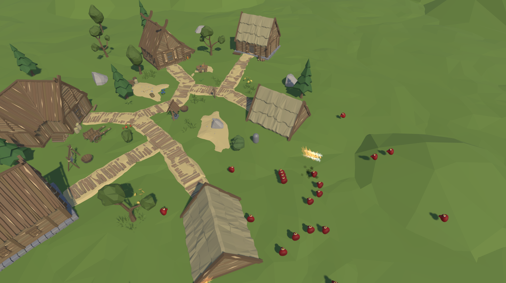

# **Unity ECS Adventure Game**

Welcome to the **Unity ECS Adventure Game** project! This is a low-poly adventure game built using the **Unity Entity Component System (ECS)**, leveraging DOTS for improved performance and scalability.



---

## **Features**
- 🌟 **Entity Component System (ECS):**
  - Efficient game logic with ECS, ensuring high performance.
- 🏠 **Beautiful Low-Poly Environment:**
  - A charming village with houses, trees, and pathways.
- 🎯 **Dynamic Gameplay:**
  - Includes projectiles, interactive objects, and more.
- ⚡ **Optimized for Performance:**
  - Lightweight and fast, even for large-scale worlds.

---

## **Getting Started**

### **Prerequisites**
- Unity 2023.1 or later (ECS-compatible versions)
- Git (for cloning the repository)

### **Installation**
1. Clone the repository:
   ```bash
   git clone https://github.com/yourusername/ecs-adventure-game.git
   cd ecs-adventure-game
   ```
2. Open the project in Unity.

3. Make sure to install the required Unity packages via the Package Manager:
   - **Entities**
   - **Unity Physics**
   - **Jobs**

4. Hit `Play` in the Unity Editor to explore the game!

---

## **Controls**
- **Move:** `Z`, `Q`, `S`, `D` 
- **Shoot:** Left Mouse Button
- **Camera Control:** Automatically follows the player

---

## **Contributing**
We welcome contributions to this project! To contribute:
1. Fork the repository.
2. Create a new branch: `git checkout -b my-feature-branch`.
3. Make your changes and commit them: `git commit -m "Added a new feature"`.
4. Push to your fork and submit a Pull Request.

---

## **Acknowledgments**
- **Unity Technologies** for their amazing tools.
- **Low Poly Assets**: Assets used for the environment are either custom-made or freely available under open licenses.
- Special thanks to all contributors and testers.

---

## **License**
This project is licensed under the MIT License. See the `LICENSE` file for more details.
